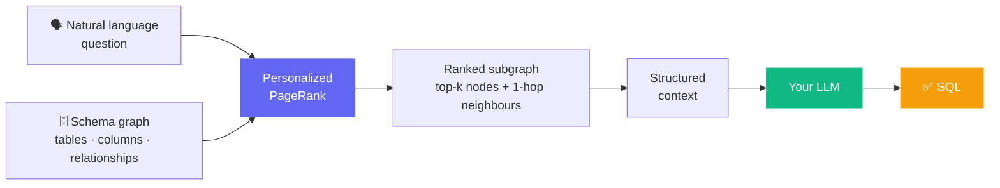

# graph2sql

[](https://github.com/jw-open/graph2sql/actions/workflows/ci.yml)
[](https://pypi.org/project/graph2sql/)

**Stop dumping your entire database schema into LLM prompts.**

When you ask an AI to write SQL, you usually paste the full schema and hope it figures out which tables matter. That works for small databases — but as your schema grows, the noise drowns out the signal, token costs rise, and accuracy drops.

graph2sql solves this by building a **schema graph** and using **Personalized PageRank** to find exactly which tables and relationships are relevant to your question — then hands that focused context to whichever LLM you choose.

**No LLM included. Bring your own model.**

---

## How it works



1. You describe your schema as a graph — tables and columns as nodes, foreign keys as edges
2. You ask a question in plain English
3. graph2sql ranks the most relevant nodes using Personalized PageRank
4. You get a clean subgraph — not the whole schema, just what matters
5. Feed it to any LLM and get better SQL with fewer tokens

---

## Install

```bash
pip install graph2sql
```

---

## Quick start

```python
from graph2sql import SchemaGraph

# Describe your schema as a graph
graph = SchemaGraph()
graph.add_node("users",   "users",   content="id, name, email, country")
graph.add_node("orders",  "orders",  content="id, customer_id, total, created_at")
graph.add_node("products","products",content="id, name, price, category")
graph.add_node("order_items","order_items",content="id, order_id, product_id, quantity")

graph.add_edge("orders",      "users",    "belongs_to")
graph.add_edge("order_items", "orders",   "belongs_to")
graph.add_edge("order_items", "products", "references")

# Ask a question — get back only the relevant tables
context = graph.rank("total revenue by customer last month", k=3)

# Pass context["nodes"] and context["edges"] to your LLM prompt
```

The `context` dict contains only the tables and relationships relevant to your question, with a relevance score on each top-k node. Feed it to GPT-4, Llama, Qwen — whatever you use.

### Load from an existing dict

If you already store your schema as JSON or a dict, you can load it directly:

```python
graph = SchemaGraph.from_dict({
    "nodes": [
        {"id": "users",  "label": "users",  "content": "id, name, email"},
        {"id": "orders", "label": "orders", "content": "id, customer_id, total"},
    ],
    "edges": [
        {"from": "orders", "to": "users", "label": "belongs_to"}
    ]
})
```

---

## Run the example

```bash
git clone https://github.com/jw-open/graph2sql
cd graph2sql
pip install -e ".[dev]"
python examples/ecommerce.py
```

---

## Schema reference

### Nodes

Each node represents a table, column, view, or any named schema entity.

| Field | Type | Required | Description |
|---|---|---|---|
| `id` | str | yes | Unique identifier |
| `label` | str | yes | Name used for query matching (table name, column name) |
| `content` | str | no | Column definitions, DDL, or a plain description |
| `attributes` | dict | no | Type, database, aliases, cardinality hints — see below |

**Common attributes:**

```python
graph.add_node("orders", "orders",
    content="id INT PK, customer_id INT FK, total DECIMAL, created_at TIMESTAMP",
    attributes={
        "type": "table",           # table | column | view | index
        "database": "postgres",    # mysql | postgres | sqlite | bigquery | snowflake | ...
        "alias": "transactions",   # alternative name matched against queries
        "primary_key": "id",
    }
)
```

### Edges

Each edge represents a relationship between two nodes.

| Field | Type | Description |
|---|---|---|
| `"from"` | str | Source node id |
| `"to"` | str | Target node id |
| `"label"` | str | Relationship type (`"belongs_to"`, `"foreign_key"`, `"references"`, ...) |

**With relationship metadata:**

```python
# Add cardinality and join hint — helps the LLM write better JOINs
graph.add_edge("orders", "users", "belongs_to")
# Extended form with attributes:
{
    "from": "orders", "to": "users", "label": "belongs_to",
    "attributes": {
        "cardinality": "many_to_one",                   # one_to_one | one_to_many | many_to_one | many_to_many
        "join": "orders.customer_id = users.id",        # explicit JOIN hint for the LLM
    }
}

# Many-to-many via junction table
{
    "from": "orders", "to": "products", "label": "many_to_many",
    "attributes": {
        "cardinality": "many_to_many",
        "via": "order_items",
        "join": "orders.id = order_items.order_id AND order_items.product_id = products.id",
    }
}
```

---

## API

```python
from graph2sql import SchemaGraph

g = SchemaGraph()
g.add_node(id, label, content=None, attributes=None)  # returns self (chainable)
g.add_edge(from_id, to_id, label)                     # returns self (chainable)
g.rank(query, k=3, alpha=0.85)                        # returns {"nodes": [...], "edges": [...]}
g.to_dict()                                           # returns raw graph dict
SchemaGraph.from_dict(graph_dict)                     # load from existing dict
```

---

## Known limitations

**Matching is exact word-level.** The algorithm matches words in your question against node labels — `"customer"` won't match a node labeled `"users"`.

**Fix: use `alias` in attributes.** Any string attribute value is also matched against your query:

```python
graph.add_node("users", "users",
    content="id, name, email",
    attributes={"alias": "customers clients members"}
)
# Now "customers" in a query matches this node
```

---

## Benchmarks

Evaluation against [BIRD-SQL](https://bird-bench.github.io/) and [Spider](https://yale-nlp.github.io/spider/) is planned for v0.2.0.

The goal: show that graph2sql-ranked context achieves comparable SQL accuracy to full-schema prompting while using significantly fewer tokens.

---

## Design goals

- Pure Python + numpy — no LLM, no database, no cloud
- Works with any model (GPT-4, Llama, Qwen, Claude, Mistral...)
- `rank()` returns a plain dict — serialize it however you want
- No FastAPI, MongoDB, Redis, or infra dependencies

---

## Run tests

```bash
pytest tests/
```

---

## License

MIT
